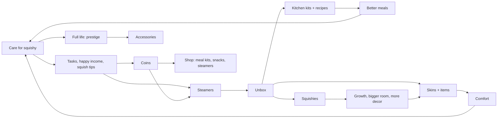

# Squishiotchi — Game Spec

First exported 25 Sep 2026 from the design doc "Squishy Dumpling Pet — Game Concept". **Updated 27 Sep 2026 to match the game as built.** Numbers live in `Assets/_Project/Resources/Content/game_content.json` and are starting points for tuning. Keep this file current when decisions change.

## Pitch

A Tamagotchi-style mobile game. Your favourite squishy dumpling lives inside a 3D bamboo steamer that you furnish and decorate. It needs daily care, grows up over a 30–60 day life, grows in size as you collect copies of it, and can die if it's neglected.

Mystery steamers, earned from care tasks or bought with coins, hold furniture skins, kitchen kits, new recipes and new squishies. A bigger collection unlocks a bigger room, the room holds more decor, and decor makes care easier. A squishy that lives a full life earns prestige for cosmetics.

The hook: the real toy's story ends once it's opened. This game is what happens next.

The browser prototype (`reference/steamer-room.html`) was the starting point; the Unity game is now the reference.

## Based on the toy

Every core system translates something people already love about mystery dumpling squishies sold in mini bamboo steamers.

| The toy | The game |
| --- | --- |
| Sealed in a mini bamboo steamer | The room is the inside of a steamer; steamers are what you unbox |
| Blind-box reveal | Unboxing items, recipes and new squishies (sometimes 2–3 stacked tiers) |
| Squeezing the basket to guess what's inside | "Feel the steamer" hint before opening |
| Slow-rise squish | Squish with squeezed `> <` eyes and a smile after |
| Solid, glitter, galaxy, UV and holographic finishes | Rarity tiers |
| Mini to 12-inch Super Mega sizes | Duplicates grow your squishy through size tiers |
| One-per-country Golden Ticket | Legendary pulls |

The character, name and packaging are original. Never use another brand's name or character design.

## Design pillars

Every feature has to serve at least one of these, or it's cut.

1. **One squishy you love.** The bond with your favourite comes before the collection.
2. **Caring is the player's job.** The squishy can scrape by on its own, but only you can make it thrive.
3. **Every pull matters.** Nothing from a steamer is dead weight: it's new, it grows something, it teaches a recipe, or it turns into coins.
4. **Every item has a purpose.** Each thing in the room does something to needs, Comfort, play or the kitchen. No filler.
5. **Your room is yours.** Free, forgiving placement and hundreds of skins, so no two rooms look alike.
6. **Fair and calm.** Published odds, a pity system, no forced ads, no pressure to pay, no chat.

## Core loop

## Squishy and care

Only your favourite squishy lives in the room. Four needs (Hunger, Play, Rest, Clean) drain in real time, including while the app is closed.

**Drain:** full to empty takes about 10 h (Hunger), 8 h (Play), 14 h (Rest) and 18 h (Clean). Comfort slows it. A squishy with a need at zero for 12 hours dies.

**Who fills needs**

- **On its own, only while the app is open.** When a need drops below 35% it snacks, dozes, grooms or plays. On its own it can never take a need above 50% (snacks 60%). Nothing self-cares while the app is closed.
- **When it's content** it also wanders off to play or lounge with things by itself (45% chance each time it's idle), so there's always something to watch.
- **Only the player** can fill a need completely: cook a meal, nap with the lights off, bath and scrub, play with a toy.
- **Tuck in** (sleep mode) pauses all needs when the player knows they'll be away; waking it resumes play. It can only be tucked in when its condition is above 12%.

**Energised squishy (watching pays):** after it plays with something by itself it's energised for 60 s, slowly undulating with a few sparkles and a brief "Feeling bouncy · squish me!" bubble. Squish it in that minute for 1–5 coins; otherwise the wobble fades away over the last 20 s.

**Face and mood:** the mouth is never fixed. Content: `:3` or a smile, with the odd open grin. Fun moments (toys, tasks, tips): grin with happy `^ ^` eyes. Squished: surprised "o" with `> <` eyes, then a smile. Eating: chomping. Low needs: flat mouth. Sad: frown. Asleep: a little "o".

**Decline stages** (based on the lowest need)

| Stage | Lowest need | What the player sees |
| --- | --- | --- |
| Happy | over 50% | Bouncy, earns happy income |
| Droopy | 25–50% | Sags, flat mouth, warning bubbles |
| Flat | 10–25% | Flatter, slower, greying |
| Critical | under 10% | Grey, frowning, too weak to self-care, asks for help |

**Life, death and generations**

- **Lifespan** is 30–60 days, longer the better its average quality of life. Life stages show in its look: **Baby** (first 3 days: smaller, paler, bigger eyes, a cowlick curl), **Young**, **Adult**, **Elder** (softly faded, fluffy white brows, slower bounce).
- **Each squishy has its own life.** Making another squishy the favourite puts the current one's life (age, quality of life, stage prestige) aside and resumes the other's, or starts it as a baby. Needs belong to the room, so swapping never escapes neglect.
- **Old age:** it drifts off for good, leaves a golden keepsake, and earns prestige: 50 + 250 × quality of life (up to 300). A **baby of the same type** then starts a new life, keeping its copies and size.
- **Neglect** (a need at zero for 12 h): it dies and leaves a tombstone. No prestige.
- **Growing up well:** on reaching Young, Adult and Elder it earns a little prestige (up to 10, 15, 20) scaled by care so far. Most prestige comes at the end.
- The player then picks the next favourite from their collection. **Everything carries over**: items, skins, coins, room level, kitchen, recipes.
- **Prestige** buys accessories (42: hats, glasses and face pieces, neck pieces), worn in the room and shown in pictures. Their prices are balanced so a good life buys a few.

**Size and growth:** copies of your favourite from steamers make it grow, and each size adds decor space. Size also unlocks items (trampoline at Jumbo, beanbag at Giant).

| Size | Copies needed | Relative size | Extra decor slots |
| --- | --- | --- | --- |
| Mini | 1 | 1× | 0 |
| Standard | 3 | 1.5× | 1 |
| Jumbo | 6 | 2.1× | 2 |
| Giant | 12 | 2.9× | 3 |
| Super Mega | 25 | 4× | 4 |

**Look:** a wide, soft dome with about 10 rounded pleats fanning straight down from a smooth crown (only a slight curl, no knot or bump), bead eyes with highlights, blush. Glossy material; finishes change colour, gloss, metal, glow, glitter and pattern.

## Room and placement

The room is the inside of the steamer. It starts with one of each station and grows with your collection.

| Level | Relative width | Decor slots | To unlock |
| --- | --- | --- | --- |
| 1 | 0.66× | 4 | Not used at launch |
| 2 (start) | 0.77× | 6 | Starting room |
| 3 | 0.89× | 9 | 5 squishies in collection + 400 coins |
| 4 | 1× | 12 | 10 squishies + 1,000 coins |

The Comfort panel shows room progression: current level, slots used, squishy size bonus, and what the next level needs.

**Items, pieces and skins**

- Each item type (bed, lamp, stove…) is a **piece**. Its look is a **skin**, one of 24 styles.
- Steamers mostly unlock **skins**. A skin for a type you don't own yet also gives you that piece.
- **Stations** are limited to one each per room (stools two). **Decor** is limited by room slots plus the size bonus. **One toy** is out at a time; swap toys from storage.

**Arrange mode**

- Drag any item anywhere. Items dropped on each other slide apart; nothing is ever refused.
- Push an item to the wall and it snaps there, facing the room. Turn 45° with a button, or twist two fingers for 15° steps. Undo is always available.
- Select an item to swap its skin from a strip of unlocked skins. Put items away into Storage and place them back.
- Wall panels and folding screens divide the room. The shower curtain draws closed while in use.
- **Stations form by nearness:** tea time needs a seat anywhere near the table.

**Comfort**

- Each decor piece adds Comfort (see Items). Three pieces from one style add a +3 set bonus. Wilted plants count less.
- Comfort slows need drain by 2% per point, up to 40%.
- Happy income: 1 coin a minute × (1 + Comfort ÷ 20) while Happy.

## Items and stations

23 item types, each in all 24 styles.

| Item | Kind | What happens | Need | Comfort |
| --- | --- | --- | --- | --- |
| Bed | Furniture | Nap. Lamp off gives a full rest; lamp on, half | Rest | 2 |
| Stool (max 2) | Furniture | Seat for tea time | — | 1 |
| Floor cushion | Furniture | Lounging; also a tea seat | Rest | 1 |
| Beanbag | Furniture | Lounging; needs Giant size | Rest | 2 |
| Tea table | Station | Tea time, sitting on a nearby seat | Rest, Hunger | 1 |
| Stove | Station | Opens the Cook menu | Hunger | 0 |
| Pantry cupboard | Station | Snack from your snack stock, up to 60% | Hunger | 0 |
| Sink | Station | Quick wash, up to 65% | Clean | 0 |
| Bathtub | Station | An open tub with water, foam and a rubber duck; the squishy floats face-up; rub it to scrub | Clean | 1 |
| Shower | Station | Shower with scrubbing; curtain animates | Clean | 0 |
| Ball | Toy | Kick it, or flick it round the room | Play | 0 |
| Pom-pom wand | Toy | It chases the pom-pom as you drag it | Play | 0 |
| Bubble wand | Toy | Pop the bubbles it blows | Play | 0 |
| Toy xylophone | Toy | Tap the bars to play; it bops along | Play | 0 |
| Slide | Toy | It climbs and slides | Play | 0 |
| Trampoline | Toy | Bouncing; needs Jumbo size | Play | 0 |
| Lamp | Decor | Lights on or off (affects naps) | — | 2 |
| Plant | Decor | Wilts unless watered | — | 2 |
| Shelf | Decor | Decor | — | 2 |
| Wardrobe | Decor | Decor | — | 2 |
| Rug | Floor | Walkable floor decor | — | 1 |
| Wall panel | Wall | Divides the room | — | 0 |
| Folding screen | Wall | Divides the room | — | 1 |

**Plants of the world:** each style's plant is a species from its region: lucky bamboo (Teahouse), bonsai pine (Tatami), maple (Hanok), banana (Block-print), date palm (Riad), cypress (Persian Garden), saguaro (Talavera), snake plant (West African Textile), olive (Mediterranean), spruce (Scandinavian), fuchsia (Andean), sunflowers (Folk), lavender (Cottagecore), fiddle-leaf fig (Mid-century), jade (Minimal), cherry blossom (Candy Shop), coconut palm (Seaside), air plant (Star Station), Venus flytrap (Spooky Manor), tulips (Pixel Den), monstera (Greenhouse), lemon tree (Bakery), aloe (Retro Diner), Boston fern (Cosy Library).

The tombstone from a neglect death and the keepsake from old age stay in the room: movable, not storable or sellable.

## Kitchen

Meals are cooked from ingredients using tools. **Snacks are separate**: bought items, never ingredients.

**How cooking plays out**

1. Tap the stove to open the Cook menu. It lists **only recipes you know**, each with its ingredients, tools, anything missing and a note; the bottom says how many are left to discover.
2. The squishy goes to the stove. The recipe's main tool works (wok tosses, rolling pin rolls, spatula flips) for about 2.5 s.
3. A bowl appears and the squishy eats it, chomping; Hunger fills as the bowl empties.

**Recipes are the fillings found inside dumplings** (the squishy doesn't ask questions). 17 recipes; ★ = known from the start, the rest are taught by kitchen kits from steamers.

| Recipe | Ingredients | Tools | Level | Hunger | Bonus | Note |
| --- | --- | --- | --- | --- | --- | --- |
| ★ Plain congee | none (always free) | none | 1 | up to 60% | — | A hug in a bowl |
| Char siu pork | Pork, Soy sauce, Sugar | Wok | 2 | +65% | — | The filling of a char siu bao |
| ★ Pork & chive stir-fry | Pork, Chives | Wok | 1 | +45% | — | Jiaozi filling, minus the jiaozi |
| Pork & cabbage mince | Pork, Cabbage, Ginger | Cleaver | 2 | +50% | — | Gyoza filling |
| Garlic prawns | Prawn, Ginger, Chives | Wok | 3 | +50% | Play +10% | Inside a har gow |
| ★ Golden custard | Egg, Sugar | Mini steamer | 1 | +40% | Rest +8% | Liu sha lava custard |
| Red bean soup | Red bean paste, Sugar | Ladle | 1 | +40% | Rest +8% | Dou sha bun filling |
| Lotus seed pudding | Lotus seeds, Sugar | Mini steamer | 3 | +45% | Rest +12% | Lian rong bao filling |
| Soup dumpling broth | Pork, Ginger, Chives | Ladle | 2 | +45% | Rest +10% | Xiao long bao soup |
| Siu mai meatballs | Pork, Prawn, Mushroom | Cleaver, Mini steamer | 3 | +60% | — | The siu mai trio |
| Kimchi tofu stew | Kimchi, Tofu, Pork | Ladle | 3 | +55% | Play +10% | Mandu filling |
| Cheesy potato mash | Potato, Cheese | Fork set | 2 | +55% | Play +8% | Pierogi filling |
| Black sesame soup | Black sesame, Sugar | Ladle | 2 | +40% | Rest +10% | Tangyuan filling |
| ★ Mushroom & bok choy | Mushroom, Bok choy, Tofu | Wok | 1 | +45% | — | Veggie dumpling filling |
| Chili pork | Pork, Chili, Soy sauce | Wok, Cleaver | 4 | +65% | Play +12% | Chili oil wonton filling |
| ★ Egg & chive scramble | Egg, Chives | Spatula | 1 | +40% | — | Veggie jiaozi favourite |
| Mystery dumplings | Flour, Pork, Cabbage, Chives | Rolling pin, Mini steamer | 4 | +80% | Play +15% | Best not to think about it |

**Recipe mastery:** every 3 cooks earns a star, up to 5. Each star adds 10% to Hunger and bonus.

| Tool | Rarity | Uses before breaking | Price |
| --- | --- | --- | --- |
| Spatula, Fork set, Ladle, Chopsticks | Common | 18 | 60 coins (shop) |
| Cleaver, Wok, Rolling pin, Mini steamer | Rare | 30 | Steamers only |

- **Kitchen level** from tools owned: 2 at 2 tools, 3 at 4, 4 at 6. Tools hang on a rack above the stove; the stove gains pots and a hood as it levels.
- **Wear:** each cook uses one use of every tool in the recipe. Broken tools block recipes until repaired in the shop.
- **Kitchen kits** (steamers): a recipe's tools plus ingredients, and they teach the recipe if it's new (unknown recipes are favoured).
- **Meal kits** (shop): ingredients for 2 cooks of a recipe you know, 7 coins per ingredient per kit. Common ingredients aren't sold loose or dropped alone; Rare ingredients can drop from steamers.
- **Ingredients (19):** Flour, Cabbage, Chives, Ginger, Mushroom, Prawn, Tofu, Egg, Black sesame, Pork, Bok choy, Chili, Red bean paste, Lotus seeds, Soy sauce, Potato, Cheese, Kimchi, Sugar.
- **Snacks (5):** Rice cracker, Apple slices, Mochi bite, Egg tart, Sesame ball; 3 coins; eaten at the pantry cupboard; Hunger to 60% max.
- **Tool skins:** Classic, Copper, Jade, Candy, Gold from steamers; shown on the rack and while cooking.

## Economy

Currencies: **coins** (earned by playing), **steamers** (opened for rewards), **prestige** (from lives lived well). New players start with 248 coins and 3 steamers.

| Source | Amount |
| --- | --- |
| Care task | 15–50 coins each |
| Finishing a set of 3 tasks | +2 steamers |
| Task streak | 3 days: +1 steamer; 7 days: +2 steamers |
| Weekly goal (15 tasks) | +3 steamers |
| Gift steamer | 1 every 3 hours (free players watch an optional short video; paid players just claim) |
| Happy income | 1 coin/min while Happy, scaled by Comfort |
| Squish when energised | 1–5 coins |
| Visiting a friend | 3 coins per caring action (they get 2) |
| Completing a squishy tree tier | 2–5 steamers |
| Duplicate furniture skin | 20 coins |
| Duplicate tool / tool skin / steamer skin | 10 / 15 / 30 coins |

**Care tasks:** 3 at a time; a claimed task is replaced after a 3-hour wait (tasks are rate-limited, not farmable). The scrub task counts the moment you rub the squishy in the bath or shower.

| Task | Reward |
| --- | --- |
| Cook a recipe (not congee) | 40 |
| Scrub your squishy in the bath or shower | 30 |
| Play fetch: 5 kicks | 30 |
| Nap with the lights off | 30 |
| Stay Happy for 3 minutes | 50 |
| Have tea time | 25 |
| Squish 10 times | 20 |
| Water a plant | 15 |
| Give a snack | 15 |

| Shop item | Price |
| --- | --- |
| Steamer | 150 |
| Snack | 3 |
| Meal kit (2 cooks) | 7 per ingredient |
| Common tool | 60 |
| Tool repair | ~half the tool's price, scaled by wear |
| Accessories | prestige |
| Room level 3 / 4 | 400 / 1,000 (plus collection size) |

No furniture is sold in the shop; furniture comes from steamers.

## Steamers and odds

| Rarity | Chance |
| --- | --- |
| Common | 76% |
| Rare | 18% |
| Epic | 5% |
| Legendary | 1% |

- **Pity:** Rare+ guaranteed within 10 steamers; Epic+ within 50. Counter shown on the Odds button. Odds always visible.
- **Stacked steamers:** 15% have 2 tiers and 5% have 3, each with its own prize.
- **Contents:** furniture skins, kitchen kits (Common and Rare), Rare ingredients, squishies (40% chance to be a copy of your favourite, never for Legendary), tool skins, steamer skins.
- **Legendary:** one of 6 legendary squishies, or a Gold / Galaxy steamer skin. Gold is metallic with a cream floor.

**The reveal** happens on the counter of a softly blurred, gently animated professional kitchen: steamer drops in → hold anywhere to build steam (rattle, rim glow, haptic ticks) → lid blows off → prize lands on a display plate (the plate only for food) → a card shows what it is, whether it's new, and what it did → the opened steamer slides away and a fresh one slides in.

## Catalogue and styles

Thumbnails are rendered from the real 3D models. Locked entries show a lock badge. An **Owned only** filter is on every tab. Any style can be previewed across the whole room. The squishy collection tree lives on the Squishies screen (the name chip, top left), not in the catalogue.

| Collection | Count |
| --- | --- |
| Room styles | 24 |
| Furniture and wall/floor skins (23 × 24) | 552 |
| Squishy types | 56 |
| Kitchen tools × tool skins | 8 × 5 |
| Recipes | 17 |
| Ingredients / snacks | 19 / 5 |
| Steamer skins | 8 |
| Accessories (prestige) | 42 |

**World styles:** Cantonese Teahouse, Japanese Tatami, Korean Hanok, Indian Block-print, Moroccan Riad, Persian Garden, Mexican Talavera, West African Textile, Mediterranean, Scandinavian, Andean Weave, Eastern European Folk.

**Mood styles:** Cottagecore, Mid-century, Minimal, Candy Shop, Seaside, Star Station, Spooky Manor, Pixel Den, Greenhouse, Bakery, Retro Diner, Cosy Library.

Culture sets: everyday domestic objects and patterns only, never sacred or ceremonial symbols; review each with people from that culture before launch. Deliberately no Māori set.

**Squishy types (56):**

| Tier | Rarity | Count | Examples |
| --- | --- | --- | --- |
| Common | Common | 19 | Peach, Taro, Matcha, Mint, Coral, Blueberry, Charcoal, Latte |
| Glitter | Rare | 9 | Pinky (the default), Gold Dust, Frost, Mint Fizz, Rainbow Fizz, Midnight Glitter |
| Pattern | Rare | 8 | Koi, Strawberry, Sesame, Polka Dot, Candy Stripe (peppermint), Watermelon, Sprinkles, Kiwi |
| Galaxy | Epic | 5 | Nebula, Aurora, Supernova, Stardust, Deep Sea |
| UV (glowing) | Epic | 5 | Glowmint, Glowlemon, Glowpink, Glowberry, Glowtangerine |
| Holographic | Epic | 4 | Opal, Prism, Pearl, Oil Slick |
| Legendary | Legendary | 6 | Golden Ticket, Violet Sparkle (the icon squishy), Rose Gold, Moonbeam, Cosmic Pearl, Candy Floss |

## Friends

Built on Unity Gaming Services (anonymous sign-in, public Cloud Save data). Decided 27 Sep 2026.

- **Friend codes** (like `ABCD-2345`) are the only way to find someone. There's no search, no list of strangers, no chat and no personal details: friends see each other's squishy, room and code only.
- **Visiting:** enter a code (or pick a friend you've visited before). Their room and squishy load into your steamer while yours is set aside untouched; time away is caught up when you go home. Their squishy doesn't drain while you visit.
- **Caring on a visit:** squish them, give a snack from your own stock, water a plant. Each kind, once per visit: 3 coins for you, and 2 for your friend, paid when they next open the game ("A friend visited and looked after…").
- **Your shared room** is refreshed every few minutes and when you open the game.
- **Setup (owner):** link the project to a Unity Cloud project, turn on Authentication (anonymous) and Cloud Save, and add Cloud Save indexes on the public player keys `code` and `visitTo` (see `docs/release.md`).
- Later ideas: stickers / preset reactions on visits, one-way gifting of duplicates (no trading), leaving a flower at a friend's keepsake.

## Notifications and widget

- **Only the squishy asking for care** sends notifications: a need getting low, a need run out, and a warning before neglect kills. No task or gift notifications.
- **Pictures, not text:** each notification is a little postcard of your own squishy (its type, mood and life stage) with a thought bubble showing what it wants (bowl, ball, moon, water drop). The title is its name; the text is just an emoji.
- **Calm policy:** never between 9 pm and 8 am (moved to the morning), and at least 3 hours apart, except the neglect warning.
- **Squishy portraits** are painted in code, icon-style, for every type × mood (happy, needs something, sad) × life stage.
- **Home-screen widget:** your squishy's portrait, name and mood, updating by itself while the app is closed.
- The status-bar icon is a squat, flat-topped dumpling.

## Art direction

Soft-block diorama with a tilt-shift miniature look.

- Chunky, soft-edged, matte blocks for furniture and steamer walls.
- Muted warm palette: terracotta, sage, cream, dusty teal, mustard.
- Tilt-shift blur keeps the squishy and what it's using in focus.
- The squishy is the one soft, round, glossy thing in every frame.
- Steamer interior: slatted bamboo walls that lower on the camera side; a slatted bamboo base as the floor; wall skin as whole-room theme.
- **App icon:** a violet glitter dumpling popping out of a bamboo steamer with the lid flying, on yellow (supplied pack, used as supplied).
- **Sound:** soft recorded foley (CC0) and calm generative ambient music, both switchable in Settings.

## Mobile controls and performance

- Portrait only. First launch: a title screen (the room slowly turning behind the logo), then a welcome card (your name, a colour, your friend code). Your name stays on the phone.
- Bottom bar: Tasks, Shop, Unbox (steamer count), Catalogue, Arrange. Top: squishy chip (tree), coins, prestige, gift, Settings, Friends.
- Home camera follows the squishy; drag to turn and tilt; **pinch zooms smoothly through close-up, follow and whole room** (no view button).
- Hold-to-charge unboxing anywhere on screen; haptic ticks.
- Target 60 fps (min 30) on ~2021 mid-range phones. One full-screen post effect. Cheap lighting for scenery; quality material only on the squishy. Instanced, pooled particles. Adaptive resolution.
- Offline time simulated on resume; a trusted-time guard stops clock rewinds.

## Monetisation and ethics

- **Free:** one squishy life or 28 days, whichever comes first, with optional rewarded videos (for the gift steamer) and light banners. No pop-up ads.
- **Paid unlock:** a one-off purchase removes ads and limits; the gift steamer is claimed directly.
- Coins are earned by playing; steamers can be bought with coins. Accessories cost prestige, which only comes from caring.
- Odds published; pity guarantee. No forced ads.
- Young players: check Apple Kids Category, Google Families policy and under-13 privacy law before release. No chat; friend codes only.
- IP: original characters and packaging only. Check "Squishiotchi" for trademark conflicts before release.

## Open questions

- [x] Engine: Unity 6 with URP.
- [x] Real-money model: free trial with light ads vs one-off paid unlock.
- [ ] Release pacing: drain hours per need, time at zero before death (current values above are first guesses).
- [x] Lifespan and old-age prestige.
- [x] Daily task refresh, streaks, weekly goals.
- [x] Notification policy.
- [ ] Launch styles vs later event styles.
- [x] Friend features for v1: codes, visits, caring for coins.
- [x] Squishy character design.
- [ ] Server-side time and cloud save of your own game.
