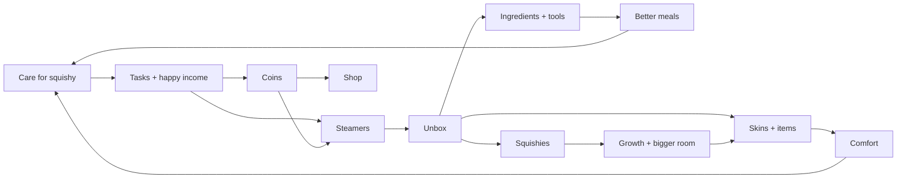

# Squishy Dumpling — Game Spec

Exported 25 Sep 2026 from the design doc "Squishy Dumpling Pet — Game Concept". The design doc is the living version; update this file when it changes.

## Pitch

A Tamagotchi-style mobile game. Your favourite squishy dumpling lives inside a 3D bamboo steamer that you furnish and decorate. It needs daily care, grows as you collect copies of it, and can die if it's neglected.

Mystery steamers, earned from care tasks or bought with coins, hold furniture skins, ingredients, kitchen tools and new squishies. A bigger collection unlocks a bigger room, the room holds more decor, and decor makes care easier.

The hook: the real toy's story ends once it's opened. This game is what happens next.

A working prototype (`reference/steamer-room.html`) covers every system below. Its numbers are starting points for tuning, not final values.

## Based on the toy

Every core system translates something people already love about the Squishy Bun Mystery Dumpling (a $5 slow-rise squishy sold in a mini bamboo steamer, 500M+ TikTok views).

| The toy | The game |
| --- | --- |
| Sealed in a mini bamboo steamer | The room is the inside of a steamer; steamers are what you unbox |
| Blind-box reveal | Unboxing items and new squishies |
| Squeezing the basket to guess what's inside | "Feel the steamer" hint before opening |
| Slow-rise squish | Squish that changes with mood |
| Solid, glitter, galaxy, UV and holographic finishes | Rarity tiers |
| Mini to 12-inch Super Mega sizes | Duplicates grow your squishy through size tiers |
| One-per-country Golden Ticket | Legendary pulls |

The character and packaging are original — not the Squishy Bun name or RMS USA's smiley-bao design.

## Design pillars

Every feature has to serve at least one of these, or it's cut.

1. **One squishy you love.** The bond with your favourite comes before the collection.
2. **Caring is the player's job.** The squishy can scrape by on its own, but only you can make it thrive.
3. **Every pull matters.** Nothing from a steamer is dead weight: it's new, it grows something, or it turns into coins.
4. **Every item has a purpose.** Each thing in the room does something to needs, Comfort or the kitchen. No filler.
5. **Your room is yours.** Free, forgiving placement and hundreds of skins, so no two rooms look alike.
6. **Fair and calm.** Published odds, a pity system, no forced ads, and no pressure to pay.

## Core loop

Care earns coins and steamers. Steamers fill the room and kitchen, and a better room and kitchen make care easier.

## Squishy and care

Only your favourite squishy lives in the room. Four needs (Hunger, Play, Rest, Clean) drain all the time, including while the app is closed.

**Who fills needs**

- **On its own**, the squishy looks after itself when a need drops below 35%: it snacks, dozes, grooms or nudges the ball. On its own it can never get a need above 50% (snacks 60%).
- **Only the player** can fill a need completely, by sending it to a station: cook a meal, nap with the lights off, bath and scrub, play fetch.
- **Comfort** slows the drain (see Room).
- **Neglect** (decided 25 Sep 2026): self-care weakens the longer the player stays away. It's at full strength right after any player care and fades to nothing, so a squishy that's never looked after ends up sad (no happy income), then its self-care fails, and after about 2 days of neglect it dies. Test speed: about 45 minutes. Any player care resets it.

**Decline stages** (based on the lowest need)

| Stage | Lowest need | What the player sees |
| --- | --- | --- |
| Happy | over 50% | Bouncy, earns happy income |
| Droopy | 25–50% | Sags, hops lower, "Hungry!"-style warnings |
| Flat | 10–25% | Flatter, slower, starting to grey |
| Critical | under 10% | Grey, eyes half shut, too weak to self-care, asks for help |

**Death and generations**

- If any need sits at zero too long, the squishy dies. The prototype uses 5 minutes of game time; the release target is about 24 hours at zero, with escalating notifications first.
- A neglect death leaves a **tombstone** in the room. Dying of old age gives a **prestige award** instead (lifespan to be decided).
- The player then picks the next favourite from their collection. **Everything carries over**: items, skins, coins, room level, kitchen.
- **Prestige** is a currency spent on rare cosmetic skins.

**Drain speed:** the prototype empties a full need in about 20–40 minutes for testing. Release target: 8–16 hours from full to empty, tuned in playtests.

**Size and growth** — copies of your favourite from steamers make it grow. Size unlocks items (trampoline at Jumbo, beanbag at Giant).

| Size | Copies needed | Relative size |
| --- | --- | --- |
| Mini | 1 | 1× (smaller than a stool) |
| Standard | 3 | 1.5× |
| Jumbo | 6 | 2.1× |
| Giant | 12 | 2.9× |
| Super Mega | 25 | 4× |

**Rules**

- Changing the favourite works like a skin change. Age, needs and mood carry across, so swapping never escapes neglect.
- Personality changes reactions, never access: every squishy can use every item it's big enough for.
- Press and hold to squish, with a slow rise that depends on the finish (foam is slow, UV jelly wobbles).

## Room and placement

The room is the inside of the steamer. It starts small, with one of each item type, and grows with your collection.

| Level | Relative width | Decor slots | To unlock |
| --- | --- | --- | --- |
| 1 | 0.66× | 4 | Not used at launch |
| 2 (start) | 0.77× | 6 | Starting room |
| 3 | 0.89× | 9 | 5 squishies in collection + 400 coins |
| 4 | 1× | 12 | 10 squishies + 1,000 coins |

**Items, pieces and skins**

- Each item type (bed, lamp, stove…) is a **piece**. Its look is a **skin**, one of 24 styles.
- Steamers mostly unlock **skins**. A skin for a type you don't own yet also gives you that piece.
- **Stations** are limited to one each per room (stools two). **Decor** is limited by the room's decor slots.
- Extra decor pieces and missing stations can be bought in the shop.

**Arrange mode**

- Drag any item anywhere. Items dropped on each other slide apart; nothing is ever refused.
- Push an item to the wall and it snaps there, facing the room. Turn 45° with a button, or twist two fingers for 15° steps. Undo is always available.
- Select an item to swap its skin from a strip of unlocked skins. Put items away into Storage and place them back.
- Camera: + / − zoom, a tilt button (top-down, angled, low), drag to turn and tilt, pinch to zoom, two-finger pan. Pans at the screen edge while dragging an item.
- Wall panels and folding screens divide the room. The shower curtain draws closed while in use.
- **Stations form by nearness:** tea time needs a seat anywhere near the table.

**Comfort**

- Each decor piece adds Comfort (see Items). Three pieces from one style add a +3 set bonus. Wilted plants count less.
- Comfort slows need drain by 2% per point, up to 40%.
- Happy income: 2 coins a minute × (1 + Comfort ÷ 20). The starting room earns about 3.6 a minute.

## Items and stations

19 item types, each in all 24 styles (456 skins).

| Item | Kind | What happens | Need | Comfort |
| --- | --- | --- | --- | --- |
| Bed | Station | Nap. Lamp off gives a full rest; lamp on, half | Rest | 2 |
| Stool (max 2) | Station | Seat for tea time | — | 1 |
| Tea table | Station | Tea time, sitting on a nearby seat | Rest, Hunger | 1 |
| Stove | Station | Opens the Cook menu | Hunger | 0 |
| Pantry cupboard | Station | Quick snack, up to 60% | Hunger | 0 |
| Sink | Station | Quick wash, up to 65% | Clean | 0 |
| Bathtub | Station | Bath; player scrubs with a finger | Clean | 1 |
| Shower | Station | Shower with scrubbing; curtain animates | Clean | 0 |
| Ball | Toy | Kick it, or the player flicks it round the room | Play | 0 |
| Trampoline | Toy | Bouncing; needs Jumbo size | Play | 0 |
| Beanbag | Decor | Lounging; needs Giant size | Rest | 2 |
| Floor cushion | Decor | Lounging; also a tea seat | Rest | 1 |
| Lamp | Decor | Lights on or off (affects naps) | — | 2 |
| Plant | Decor | Wilts unless watered | — | 2 |
| Shelf | Decor | Decor | — | 2 |
| Wardrobe | Decor | Decor | — | 2 |
| Rug | Decor | Walkable floor decor | — | 1 |
| Wall panel | Decor | Divides the room | — | 0 |
| Folding screen | Decor | Divides the room | — | 1 |

The tombstone from a neglect death is a keepsake: movable, not storable or sellable.

## Kitchen

Meals are cooked from ingredients using tools. Snacks are separate: cheap, quick, never made from recipe ingredients.

**How cooking plays out**

1. Tap the stove to open the Cook menu. Each recipe shows ingredients, tools and anything missing.
2. The squishy goes to the stove. The recipe's main tool appears and works (wok tosses, rolling pin rolls, spatula flips) for about 2.5 s.
3. A bowl appears and the squishy eats it; Hunger fills as the bowl empties.

| Recipe | Ingredients | Tools | Kitchen level | Hunger | Bonus |
| --- | --- | --- | --- | --- | --- |
| Plain congee | none (always free) | none | 1 | up to 60% | — |
| Scallion buns | Flour, Scallion | Mini steamer | 1 | +40% | — |
| Mushroom omelette | Egg, Mushroom | Spatula | 1 | +40% | Play +10% |
| Ginger soup | Ginger, Carrot, Scallion | Ladle | 2 | +35% | Rest +20% |
| Sesame balls | Flour, Sesame | Wok | 2 | +30% | Play +20% |
| Veg dumplings | Flour, Cabbage, Mushroom | Rolling pin, Mini steamer | 2 | +55% | Rest +10% |
| Tofu stir-fry | Tofu, Bok choy, Chili | Wok, Spatula | 3 | +55% | Play +15% |
| Prawn har gow | Flour, Prawn, Scallion | Rolling pin, Mini steamer, Cleaver | 3 | +70% | Clean +10% |
| Chili wontons | Flour, Prawn, Chili | Cleaver, Rolling pin, Chopsticks | 4 | +65% | Play +25% |

**Recipe mastery:** every 3 cooks earns a star, up to 5. Each star adds 10% to Hunger and bonus.

| Tool | Rarity | Uses before breaking | Price |
| --- | --- | --- | --- |
| Spatula, Fork set, Ladle, Chopsticks | Common | 18 | 60 coins (shop) |
| Cleaver, Wok, Rolling pin, Mini steamer | Rare | 30 | Steamers only |

- **Kitchen level** from tools owned: 2 at 2 tools, 3 at 4, 4 at 6. Tools hang on a rack above the stove; the stove gains pots and a hood as it levels.
- **Wear:** each cook uses one use of every tool in the recipe. Broken tools block recipes until repaired in the shop (about half price, scaled by wear).
- **Tool skins:** Classic, Copper, Jade, Candy, Gold from steamers; equip in the catalogue; shown on the rack and while cooking.
- **Ingredients:** 12. Flour, Cabbage, Scallion, Tofu, Egg, Carrot cost 8 coins; the rest (incl. Prawn, Chili) only from steamers.
- **Snacks:** Rice cracker, Apple slices, Mochi bite; 5 coins; eaten only from the pantry cupboard; Hunger to 60% max.

## Economy

Currencies: **coins** (earned by playing), **steamers** (opened for rewards), **prestige** (old-age lives). New players start with 248 coins and 3 steamers.

| Source | Amount |
| --- | --- |
| Care task | 15–50 coins each |
| Finishing a set of 3 tasks | +1 steamer |
| Happy income | about 2–4 coins/min while Happy, scaled by Comfort |
| Duplicate furniture skin | 20 coins |
| Duplicate tool / tool skin / steamer skin | 10 / 15 / 30 coins |

Care tasks (3 active; claimed tasks are replaced; release: daily refresh + streaks):

| Task | Reward |
| --- | --- |
| Cook a recipe (not congee) | 40 |
| Scrub your squishy in the bath or shower | 30 |
| Play fetch: 5 kicks | 30 |
| Nap with the lights off | 30 |
| Stay Happy for 3 minutes | 50 |
| Have tea time | 25 |
| Squish 10 times | 20 |
| Water a plant | 15 |
| Give a snack | 15 |

| Shop item | Price |
| --- | --- |
| Steamer | 150 |
| Snack | 5 |
| Common ingredient | 8 |
| Common tool | 60 |
| Tool repair | ~half the tool's price, scaled by wear |
| Extra decor piece | 50–140 |
| Missing station | 120–300 |
| Room level 3 / 4 | 400 / 1,000 (plus collection size) |

## Steamers and odds

| Rarity | Chance |
| --- | --- |
| Common | 76% |
| Rare | 18% |
| Epic | 5% |
| Legendary | 1% |

- **Pity:** Rare+ guaranteed within 10 steamers; Epic+ within 50. Counter shown on the Odds button. Odds shown in-game (store requirement).
- **Contents overall:** furniture skins ~55%, ingredients 23%, squishies 14%, kitchen tools 6%, steamer/tool skins ~2%. A squishy result has a 40% chance to be a copy of your favourite.
- **Legendary:** Golden Ticket squishy, or a Gold / Galaxy steamer skin.
- Prototype simulation (10,000 opens): 74 / 19 / 5.6 / 1%.

**The reveal** (separate space on the kitchen counter): steamer drops in → hold anywhere to build steam (rattle, rim glow, steam, haptic ticks) → lid blows off with flash, steam and confetti → prize launches, lands on a display plate at a consistent size → card shows what it is, whether it's new, and what it did.

## Catalogue and styles

In-game catalogue with thumbnails rendered from the real 3D models; locked entries in colour with a lock badge; any style can be previewed across the whole room.

| Collection | Count |
| --- | --- |
| Room styles | 24 |
| Furniture and wall/floor skins (19 × 24) | 456 |
| Squishy finishes | 24 |
| Kitchen tools × tool skins | 8 × 5 |
| Recipes | 9 |
| Ingredients / snacks | 12 / 3 |
| Steamer skins | 8 |

**World styles:** Cantonese Teahouse, Japanese Tatami, Korean Hanok, Indian Block-print, Moroccan Riad, Persian Garden, Mexican Talavera, West African Textile, Mediterranean, Scandinavian, Andean Weave, Eastern European Folk.

**Mood styles:** Cottagecore, Mid-century, Minimal, Candy Shop, Seaside, Star Station, Spooky Manor, Pixel Den, Greenhouse, Bakery, Retro Diner, Cosy Library.

Culture sets: everyday domestic objects and patterns only, never sacred or ceremonial symbols; review each with people from that culture before launch. Deliberately no Māori set.

Squishy finishes: 8 Common colours; Glitter and Pattern (Koi, Strawberry, Sesame) Rare; Galaxy, UV, Holographic Epic; Golden Ticket Legendary.

## Friends (post-launch proposal)

- Squishy visits to a friend's tea station (both get a bonus; gift on return).
- Squishy-sitting: a friend can do one care action a day for you.
- Room visits with stickers / preset reactions.
- One-way gifting of duplicates (no trading).
- Memorial visits: leave a flower at a friend's tombstone.
- Safety: friends added in person (QR / friend code), no open chat, preset stickers only.

## Art direction

Soft-block diorama with a tilt-shift miniature look.

- Chunky, soft-edged, matte blocks for furniture and steamer walls.
- Muted warm palette: terracotta, sage, cream, dusty teal, mustard.
- Tilt-shift blur keeps the squishy and what it's using in focus.
- The squishy is the one soft, round, glossy thing in every frame.
- Steamer interior: slatted bamboo walls that lower on the camera side; paper liner with punched holes as the floor; wall skin as whole-room theme.
- Prototype models are placeholders; release art needs a modelling pass.

## Mobile controls and performance

- Portrait only. Bottom bar: Tasks, Shop, Unbox (steamer count), Catalogue, Arrange.
- Home camera follows the squishy; drag to turn/tilt, pinch to zoom, whole-room toggle.
- Hold-to-charge unboxing anywhere on screen; haptic ticks.
- Target 60 fps (min 30) on ~2021 mid-range phones.
- One full-screen post effect (tilt-shift + grade + flash), not a chain.
- Cheap lighting for scenery; quality material only on the squishy.
- Instanced, pooled particles; capped sparkle sizes.
- Adaptive resolution.
- Offline time simulated on resume from server time.

## Engine: Unity vs Godot

Recommendation: **Unity 6** — live-service mobile needs IAP, notifications, analytics and possibly ads, where Unity's first-party support saves weeks.

| | Unity 6 | Godot 4.6 |
| --- | --- | --- |
| Cost | Free (Personal) up to $200k revenue+funding; Pro $2,310/yr/seat; Runtime Fee cancelled | Free, open source |
| Splash screen | Optional on Personal (Unity 6) | None |
| IAP | Mature, first-party | Official Play Billing + StoreKit 2 plugins; some version friction |
| Analytics / ads | First-party SDKs from almost every vendor | Biggest gap |
| Mobile 3D | Very mature | Much improved in 2026 |
| Asset store | Huge | Smaller |
| Weight | Heavy editor | Very light |
| iOS builds | Need a Mac | Need a Mac |

## Monetisation and ethics

- Coins are earned by playing; steamers can be bought with coins.
- Real money (proposal): direct cosmetic purchases only, no random results. Whether money can ever buy steamers or coins is open.
- Odds published; pity guarantee.
- No forced ads.
- Young players: check Apple Kids Category, Google Families policy and under-13 privacy law before ads, analytics or friend features.
- IP: original characters and packaging only.

## Open questions

- [ ] Engine: Unity (recommended) or Godot?
- [ ] Real-money model.
- [ ] Release pacing: drain hours per need; time at zero before death.
- [ ] Lifespan and old-age prestige award.
- [ ] Daily task refresh, streaks, weekly goals.
- [ ] Notification policy.
- [ ] Launch styles vs later event styles.
- [ ] Friend features for v1.
- [ ] Squishy character design (face, name, silhouette).
- [ ] Server-side time and save sync.
