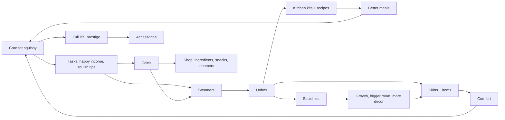

# Squishiotchi — Game Spec

First exported 25 Sep 2026 from the design doc "Squishy Dumpling Pet — Game Concept". **Updated 27 Sep 2026 to match the game as built.** Numbers live in `Assets/_Project/Resources/Content/game_content.json` and are starting points for tuning. Keep this file current when decisions change.

## Pitch

A Tamagotchi-style mobile game. Your favourite squishy dumpling lives inside a 3D bamboo steamer that you furnish and decorate. It needs daily care, grows up over a 30–60 day life, grows in size as you collect copies of it, and can die if it's neglected.

Mystery steamers, earned from care tasks or bought with coins, hold furniture skins, kitchen kits, new recipes and new squishies. A bigger collection unlocks a bigger room, the room holds more decor, and decor makes care easier. A squishy that lives a full life earns prestige for cosmetics.

The hook: the real toy's story ends once it's opened. This game is what happens next.

The browser prototype (`reference/steamer-room.html`) was the starting point; the Unity game is now the reference.

## Based on the toy

Every core system translates something people already love about mystery dumpling squishies sold in mini bamboo steamers.

| The toy | The game |
| --- | --- |
| Sealed in a mini bamboo steamer | The room is the inside of a steamer; steamers are what you unbox |
| Blind-box reveal | Unboxing items, recipes and new squishies (sometimes 2–3 stacked tiers) |
| Squeezing the basket to guess what's inside | "Feel the steamer" hint before opening |
| Slow-rise squish | Squish with squeezed `> <` eyes and a smile after |
| Solid, glitter, galaxy, UV and holographic finishes | Rarity tiers |
| Mini to 12-inch Super Mega sizes | Duplicates grow your squishy through size tiers |
| One-per-country Golden Ticket | Legendary pulls |

The character, name and packaging are original. Never use another brand's name or character design.

## Design pillars

Every feature has to serve at least one of these, or it's cut.

1. **One squishy you love.** The bond with your favourite comes before the collection.
2. **Caring is the player's job.** The squishy can scrape by on its own, but only you can make it thrive.
3. **Every pull matters.** Nothing from a steamer is dead weight: it's new, it grows something, it teaches a recipe, or it turns into coins.
4. **Every item has a purpose.** Each thing in the room does something to needs, Comfort, play or the kitchen. No filler.
5. **Your room is yours.** Free, forgiving placement and hundreds of skins, so no two rooms look alike.
6. **Fair and calm.** Published odds, a pity system, no forced ads, no pressure to pay, no chat.

## Core loop

```mermaid
flowchart LR
  A[Care for squishy] --> B[Tasks, happy income, squish tips]
  B --> C[Coins]
  B --> D[Steamers]
  C --> E[Shop: ingredients, snacks, steamers]
  C --> D
  D --> F[Unbox]
  F --> G[Skins + items]
  F --> H[Kitchen kits + recipes]
  F --> I[Squishies]
  G --> J[Comfort]
  H --> K[Better meals]
  I --> L[Growth, bigger room, more decor]
  J --> A
  K --> A
  L --> G
  A --> M[Full life: prestige]
  M --> N[Accessories]
```

## Squishy and care

Only your favourite squishy lives in the room. Four needs (Hunger, Play, Rest, Clean) drain in real time, including while the app is closed.

**Drain:** full to empty takes about 10 h (Hunger), 8 h (Play), 14 h (Rest) and 18 h (Clean). Comfort slows it. A squishy with a need at zero for 12 hours dies.

**Who fills needs**

- **On its own, only while the app is open.** When a need drops below 35% it snacks, dozes, grooms or plays. On its own it can never take a need above 50% (snacks 60%). Nothing self-cares while the app is closed.
- **When it's content** it also wanders off to play or lounge with things by itself (45% chance each time it's idle), so there's always something to watch.
- **Only the player** can fill a need completely: cook a meal, nap with the lights off, bath and scrub, play with a toy.
- **Tuck in** (sleep mode) pauses all needs when the player knows they'll be away; waking it resumes play. It can only be tucked in when its condition is above 12%.

**Energised squishy (watching pays):** after it plays with something by itself it's energised for 60 s, slowly undulating with a few sparkles and a brief "Feeling bouncy · squish me!" bubble. Each time, 1–5 coins go into a little gold coin spinning over its head. Tips pile up there for up to 5 minutes after the first (then it just waits, never disappearing), and one squish collects them all, so there's no need to keep tapping.

**Tactile toy:** zoomed right in, touches press slow-rise dents into the squishy (hold deeper, drag to smear, memory-foam rise; jelly finishes rise quicker). Dents are a fixed size in the world, so a bigger squishy has more to squish. Zoomed out, holding on it squeezes it until it pings out from under your finger and bounces round the room. Rare and better squishies shed soft particles in their own style when squished or bouncing.

**Face and mood:** the mouth is never fixed. Content: `:3` or a smile, with the odd open grin. Fun moments (toys, tasks, tips): grin with happy `^ ^` eyes. Squished: surprised "o" with `> <` eyes, then a smile. Eating: chomping. Low needs: flat mouth. Sad: frown. Asleep: a little "o".

**Decline stages** (based on the lowest need)

| Stage | Lowest need | What the player sees |
| --- | --- | --- |
| Happy | over 50% | Bouncy, earns happy income |
| Droopy | 25–50% | Sags, flat mouth, warning bubbles |
| Flat | 10–25% | Flatter, slower, greying |
| Critical | under 10% | Grey, frowning, too weak to self-care, asks for help |

**Life, death and generations**

- **Lifespan** is 30–60 days, longer the better its average quality of life. Life stages show in its look: **Baby** (first 3 days: smaller, paler, bigger eyes, a cowlick curl), **Young**, **Adult**, **Elder** (softly faded, fluffy white brows, slower bounce).
- **Each squishy has its own life.** Making another squishy the favourite puts the current one's life (age, quality of life, stage prestige) aside and resumes the other's, or starts it as a baby. Needs belong to the room, so swapping never escapes neglect.
- **Old age:** it drifts off for good, leaves a golden keepsake, and earns prestige: 50 + 250 × quality of life (up to 300). A **baby of the same type** then starts a new life, keeping its copies and size.
- **Neglect** (a need at zero for 12 h): it dies and leaves a tombstone. No prestige.
- **Growing up well:** on reaching Young, Adult and Elder it earns a little prestige (up to 10, 15, 20) scaled by care so far. Most prestige comes at the end.
- The player then picks the next favourite from their collection. **Everything carries over**: items, skins, coins, room level, kitchen, recipes.
- **Prestige** buys accessories (42: hats, glasses and face pieces, neck pieces), worn in the room and shown in pictures. Their prices are balanced so a good life buys a few.

**Size and growth:** copies of your favourite from steamers make it grow, and reaching a bigger size makes the steamer physically wider (it never shrinks back, even for the next squishy). Size also unlocks items (beanbag at Standard, trampoline at Jumbo).

| Size | Copies needed | Relative size | Steamer width |
| --- | --- | --- | --- |
| Mini | 1 | 1× | 0.66× |
| Standard | 3 | 1.5× | 0.77× |
| Jumbo | 6 | 2.1× | 0.89× |
| Giant | 12 | 2.9× | 1× |
| Super Mega | 25 | 4× | 1× |

**Look:** a wide, soft dome with about 10 rounded pleats fanning straight down from a smooth crown (only a slight curl, no knot or bump), bead eyes with highlights, blush. Glossy material; finishes change colour, gloss, metal, glow, glitter and pattern.

### Night

- Between 8pm and 7am (data) the game offers, once a night after a short while in the game, to turn in for the night; a moon button offers it any time at night. The prompt can be snoozed (the player picks 15 minutes, 30 minutes or 1 hour, data) and asks again after; "Not tonight" stops it until the next evening.
- Going to bed hands over the free steamer if one is waiting; the wake-up screen counts only the free steamers the night brought. Asleep in bed it can be squished but never pinged out of bed; its face is eyes shut with the little "w" mouth.
- Asleep: it goes to its bed in the room and sleeps there (curled up where it is if there's no bed). **Rest fills up** overnight (empty to full in about 6 hours, data); the other needs drain at 35% (data) until 10am at the latest; the free in-game steamer from each 3-hour reset in the night is collected for you. Reminders account for this and still honour quiet hours.
- **Arranging around it:** lying on the bed (asleep or napping) or sitting on a cushion or stool, it rides along when that piece is moved, lifted or turned in Arrange, and carries on afterwards (asleep stays asleep).
- **The game stays playable while it sleeps:** squish it (it stays asleep), arrange, open steamers, shop. Tapping furniture doesn't wake it (lights and watering still work); the moon button wakes it early. If morning comes while you're playing, the wake-up screen shows.
- **"Tucked in"** is the overnight sleep: the mood chip shows "Tucked in" (purple) while it's asleep for the night. Tucking in is always the player's choice: it never tucks itself in, and a squishy left up all night wakes needing care (normal drain). **Settings > Bedtime reminder** (on by default) turns the evening question on or off; the moon button tucks it in either way.
- **Holiday pause** is a setting only (Settings), never one tap away in the game: every need pauses except Rest, which fills. The chip shows "Holiday pause". It can't be switched on while Critical.
- Waking: in the morning (or opening the game while it sleeps) a wake-up screen (sunrise, how long it slept, steamers collected) replaces the title screen; before morning it offers "Back to sleep". Popping out of the app for a few minutes at night doesn't show it.

- **Clear jelly:** some finishes are see-through (firmer at the rim) with things living inside that drift on their own, scatter from a finger press and slosh when squashed or bounced: suspended glitter (Frost, Lilac/Mint/Peach Fizz, Ocean Sparkle, Rainbow Fizz, Moonbeam), glowing motes (the UV glow skins), and the Epic **Aquarium** tier: Koi Pond (koi swim away from your finger), Goldfish Bowl (goldfish and bubbles), Bubble Tea (tapioca pearls that sink and bounce), Snow Globe (snow that swirls). All in data (clear, opacity, inside, insideCount, insideColors).

- **Tactile squishing (close-up):** zoom in further than before; presses dent the finer mesh and the face rides the skin (eyes and mouth sink and tilt with a dent and spring back). Pressed-in volume swells out elsewhere like fluid in a balloon. Zooming all the way in enters **squish mode**: the camera locks onto the squishy as it goes about its day and every touch is for squishing; a "Done squishing" button leaves it. Pinch anywhere (one finger on the squishy is enough): it works like a rubber band round the squishy where you pinch. The band wraps round through both fingers, across your line of sight; the whole body cinches in to a waist there (down to about a third of its width at a full squeeze), the fluid inside is squeezed into the two halves either side, which swell and push apart (a peanut, a figure 8), and it stays one attached body. Dragging both fingers moves the band and bends it; it rises back slowly on release. Mesh detail scales with size (bigger squishies get a denser mesh, not a stretched one). It keeps doing whatever it was doing while you squish it. Sitting or lying on furniture, it drapes over the edges (a big squishy envelops a small stool).

- **Celebrations:** the squishy growing a size and a recipe levelling up each get a celebration card (confetti, stars filling in, a little fanfare, the squishy bouncing in gold glints).
- **Friends while you were away:** a friend's care carries over (a snack tops up Hunger, a squish tops up Play, watering waters your plant, plus coins), and the next time you open the game a card says who visited and exactly what they did.

## Room and placement

The room is the inside of the steamer. Every piece takes space (furniture, stations, toys and decor; a toy swapped for the one out takes none). The room starts with space for 15 (the 12 starter pieces plus 3 spare) and each room level adds one, up to 30, slower and slower. Any piece can be put away, down to an empty room ("Clear" in Arrange puts everything away after a check; Undo brings it back). The steamer's width follows the squishy's size (see Size and growth).

| Level | Pieces | Squishies in collection | Coins |
| --- | --- | --- | --- |
| 1 (start) | 15 | — | — |
| 2 | 16 | 4 | 150 |
| 3 | 17 | 5 | 200 |
| 4 | 18 | 6 | 260 |
| 5 | 19 | 7 | 330 |
| 6 | 20 | 8 | 410 |
| 7 | 21 | 9 | 500 |
| 8 | 22 | 10 | 600 |
| 9 | 23 | 11 | 720 |
| 10 | 24 | 12 | 850 |
| 11 | 25 | 13 | 1,000 |
| 12 | 26 | 14 | 1,150 |
| 13 | 27 | 16 | 1,300 |
| 14 | 28 | 18 | 1,500 |
| 15 | 29 | 20 | 1,700 |
| 16 | 30 | 22 | 2,000 |

The Comfort panel shows room progression: current level, pieces used, and what the next level needs.

**Items, pieces and skins**

- Each item type (bed, lamp, stove…) is a **piece**. Its look is a **skin**, one of 24 styles.
- Steamers mostly unlock **skins**. A skin for a type you don't own yet also gives you that piece.
- **Stations** are limited to one each per room (stools two). **Decor** is limited by room slots plus the size bonus. **Toys:** one can be out at first, and one more each time the steamer grows wider (Mini 1, Standard 2, Jumbo 3, Giant 4; data). With toy room full, placing another sends the longest-out toy to storage.

**Arrange mode**

- Drag any item anywhere. Items dropped on each other slide apart; nothing is ever refused.
- Push an item to the wall and it snaps there, facing the room. Turn 45° either way with the two Turn buttons (one each side of Done), or twist two fingers for 15° steps. Undo is always available.
- Select an item to swap its skin from a strip of unlocked skins. Put items away into Storage and place them back.
- Wall panels and folding screens divide the room. The shower curtain draws closed while in use.
- **Stations form by nearness:** tea time needs a seat anywhere near the table.
- **Combos:** pieces placed right next to one another make a set: each piece within a small gap (0.3, edge to edge) of another piece in the set, all joined up; standing on the rug counts. The squishy uses the set for a richer activity. A piece can count towards several combos at once (the same table and stool make Tea time with a cushion, and the Dinner table with a stove). A finished combo takes precedence over its pieces' own use: tapping any piece of the set starts it (the tub or the slide of a Splash slide), except a plant or lamp, which keep their jobs (watering, lights); on its own the squishy picks finished combos half the time when it plays. Each is celebrated the first time it's made. The Comfort panel lists them by name with a count (2/3) and the pieces found so far; the missing ones stay a mystery.

| Combo | Pieces | What it does |
| --- | --- | --- |
| Quiet corner | cushion, rug, plant | Sits very still, eyes shut, breathing slowly; Rest, then needs drain 20% slower for 30 min |
| Reading nook | beanbag or cushion, shelf (the bookcase), lamp | Reads a little book; Rest and Play |
| Tea time | tea table, 2 seats (stool or cushion) | Tea for two: the pot pours for each cup in turn; more Rest and Hunger. With one seat it's plain tea. |
| Dinner table | stove, tea table, stool | After cooking it carries the dish to the table and eats sitting down; a little Play on top |
| Chef's corner | stove, fridge, sink | Cooking is quicker, tools wear half as fast, 20% chance an ingredient is saved |
| Spa bath | bathtub, plant | Petals on the water, eyes shut; Clean plus Rest |
| Steamed Clean | shower, rug, dividing wall | After the shower it steps onto the rug and shakes dry; extra Clean |
| Splash slide | slide, bathtub | Down the slide and into the bath with a splash; Clean and Play |
| Playground | trampoline, ball, rug | Bounces, then kicks the ball (or the other way round); big Play |
| Concert | xylophone, cushion, rug | Plays a whole tune, then an encore bounce; Play |
| Bubble garden | bubble wand, plant, rug | More bubbles, drifting towards the plant; Play |
| Pom-pom den | pom-pom wand, cushion or beanbag, rug | After the chase it flops onto the cushion cuddling the pom-pom; Play and Rest |
| Dress-up | wardrobe, folding screen | Pops out wearing an accessory for a moment: mostly one it could still earn, sometimes one of yours |

- **While arranging, combos show up on the spot:** when a move makes a combo grow or finishes it, its pieces bounce and sparkle and a note names it with its count ("Tea time 2/3", or "Tea time!" with a chime when done); breaking one says so too. A single piece on its own isn't news. Counted from the room as it was when Arrange opened.
- **Slide docks onto the bath:** a slide dragged near a bathtub snaps square to its nearest side, facing in, the end of the ramp just over the rim. With the Splash slide it goes down once and lands right in the bath with a splash.
- Up to 2 sinks per room (bathroom and kitchen). A second sink or stool can be added fresh from the tray (the New pieces).
- **Arrange tray tabs:** Stored, then Kitchen, Bathroom, Bedroom, Living, Play, Decor, Walls and Steamer (a piece can sit under two, like the sink); each shows what's stored for that room and the New pieces you can add, so the list stays short as the collection grows.
- **Dress-up** turns to face you. **Shaking dry** flings droplets only. **Bath bubbles** are small, clear and pop; scrubbing makes clear foam bubbles; the **Spa bath** is lots more (and bigger) clear bubbles, no petals. Steam (cooking, opening steamers) is soft, see-through and round; the old faceted white puffs are gone everywhere (landings, the ball hitting the wall, keepsakes use soft glints or nothing).
- **Tea:** the teapot lifts, turns its spout to the squishy's cup and pours; cups and saucers sit in front of the seats round the table.
- **Ball:** after play, a ball left away from where it was placed pops back there after 3 seconds.
- In squish mode (zoomed right in) taps on furniture are ignored. Zoomed in close, any piece between the camera and the squishy is hidden until it's out of the way.
- **Opening steamers:** keep holding Open and it keeps going: each prize card shows for a moment, then the next layer or steamer starts charging; let go to stop.
- **Ingredient sizes on the steamer plate:** each ingredient can have a display size (data); the chilli shows at half size.
- **Getting about:** the squishy finds its way on a grid over the floor. It walks round tall pieces (stove, fridge, wardrobe, shower, walls) and, when a low piece (table, stool, cushion, bed, beanbag) is in its way, hops up onto it, across and down, and the piece bounces like a tap when it lands; brushing past a low piece's corner is a little hop over it. Chasing the ball, it slides round furniture instead of through it. Nothing is walked through.

**Comfort**

- Each decor piece adds Comfort (see Items). Three pieces from one style add a +3 set bonus. Each finished furniture combo adds +2. Wilted plants count less.
- Comfort slows need drain by 2% per point, up to 40%.
- Happy income: 1 coin a minute × (1 + Comfort ÷ 20) while Happy.

## Items and stations

23 item types, each in all 24 styles.

| Item | Kind | What happens | Need | Comfort |
| --- | --- | --- | --- | --- |
| Bed | Furniture | Nap. Lamp off gives a full rest; lamp on, half | Rest | 2 |
| Stool (max 2) | Furniture | Seat for tea time | — | 1 |
| Floor cushion | Furniture | Lounging; also a tea seat | Rest | 1 |
| Beanbag | Furniture | Lounging; needs Standard size | Rest | 2 |
| Tea table | Station | Tea time, sitting on a nearby seat | Rest, Hunger | 1 |
| Stove | Station | Opens the Cook menu | Hunger | 0 |
| Pantry cupboard | Station | Snack from your snack stock, up to 60% | Hunger | 0 |
| Sink | Station | Quick wash, up to 65% | Clean | 0 |
| Bathtub | Station | An open tub with water, foam and a rubber duck; the squishy floats face-up; rub it to scrub | Clean | 1 |
| Shower | Station | Shower with scrubbing; curtain animates | Clean | 0 |
| Ball | Toy | Kick it, or flick it round the room | Play | 0 |
| Pom-pom wand | Toy | It chases the pom-pom as you drag it | Play | 0 |
| Bubble wand | Toy | Pop the bubbles it blows | Play | 0 |
| Toy xylophone | Toy | Tap the bars to play; it bops along | Play | 0 |
| Slide | Toy | It climbs and slides | Play | 0 |
| Trampoline | Toy | Bouncing; needs Jumbo size | Play | 0 |
| Lamp | Decor | Lights on or off (affects naps) | — | 2 |
| Plant | Decor | Wilts unless watered | — | 2 |
| Shelf | Decor | Decor | — | 2 |
| Wardrobe | Decor | Decor | — | 2 |
| Rug | Floor | Walkable floor decor | — | 1 |
| Wall panel | Wall | Divides the room | — | 0 |
| Folding screen | Wall | Divides the room | — | 1 |

**Plants of the world:** each style's plant is a species from its region: lucky bamboo (Teahouse), bonsai pine (Tatami), maple (Hanok), banana (Block-print), date palm (Riad), cypress (Persian Garden), saguaro (Talavera), snake plant (West African Textile), olive (Mediterranean), spruce (Scandinavian), fuchsia (Andean), sunflowers (Folk), lavender (Cottagecore), fiddle-leaf fig (Mid-century), jade (Minimal), cherry blossom (Candy Shop), coconut palm (Seaside), air plant (Star Station), Venus flytrap (Spooky Manor), tulips (Pixel Den), monstera (Greenhouse), lemon tree (Bakery), aloe (Retro Diner), Boston fern (Cosy Library).

The tombstone from a neglect death and the keepsake from old age stay in the room: movable, not storable or sellable.

## Kitchen

Meals are cooked from ingredients using tools. **Snacks are separate**: bought items, never ingredients.

**How cooking plays out**

1. Tap the stove to open the Cook menu. It lists **only recipes you know**, each with its ingredients, tools, anything missing and a note; the bottom says how many are left to discover.
2. The squishy goes to the stove. The recipe's main tool works (wok tosses, rolling pin rolls, spatula flips) for about 2.5 s.
3. A bowl appears and the squishy eats it, chomping; Hunger fills as the bowl empties.

**Recipes are the fillings found inside dumplings** (the squishy doesn't ask questions). 17 recipes; ★ = known from the start, the rest are taught by kitchen kits from steamers.

| Recipe | Ingredients | Tools | Level | Hunger | Bonus | Note |
| --- | --- | --- | --- | --- | --- | --- |
| ★ Plain congee | none (always free) | none | 1 | up to 60% | — | A hug in a bowl |
| Char siu pork | Pork, Soy sauce, Sugar | Wok | 2 | +65% | — | The filling of a char siu bao |
| ★ Pork & chive stir-fry | Pork, Chives | Wok | 1 | +45% | — | Jiaozi filling, minus the jiaozi |
| Pork & cabbage mince | Pork, Cabbage, Ginger | Cleaver | 2 | +50% | — | Gyoza filling |
| Garlic prawns | Prawn, Ginger, Chives | Wok | 3 | +50% | Play +10% | Inside a har gow |
| ★ Golden custard | Egg, Sugar | Mini steamer | 1 | +40% | Rest +8% | Liu sha lava custard |
| Red bean soup | Red bean paste, Sugar | Ladle | 1 | +40% | Rest +8% | Dou sha bun filling |
| Lotus seed pudding | Lotus seeds, Sugar | Mini steamer | 3 | +45% | Rest +12% | Lian rong bao filling |
| Soup dumpling broth | Pork, Ginger, Chives | Ladle | 2 | +45% | Rest +10% | Xiao long bao soup |
| Siu mai meatballs | Pork, Prawn, Mushroom | Cleaver, Mini steamer | 3 | +60% | — | The siu mai trio |
| Kimchi tofu stew | Kimchi, Tofu, Pork | Ladle | 3 | +55% | Play +10% | Mandu filling |
| Cheesy potato mash | Potato, Cheese | Fork set | 2 | +55% | Play +8% | Pierogi filling |
| Black sesame soup | Black sesame, Sugar | Ladle | 2 | +40% | Rest +10% | Tangyuan filling |
| ★ Mushroom & bok choy | Mushroom, Bok choy, Tofu | Wok | 1 | +45% | — | Veggie dumpling filling |
| Chili pork | Pork, Chili, Soy sauce | Wok, Cleaver | 4 | +65% | Play +12% | Chili oil wonton filling |
| ★ Egg & chive scramble | Egg, Chives | Spatula | 1 | +40% | — | Veggie jiaozi favourite |
| Mystery dumplings | Flour, Pork, Cabbage, Chives | Rolling pin, Mini steamer | 4 | +80% | Play +15% | Best not to think about it |

**Recipe mastery:** every 5 cooks earns a star, up to 5. Each star adds 10% to Hunger and bonus.

| Tool | Rarity | Uses before breaking | Price |
| --- | --- | --- | --- |
| Spatula, Fork set, Ladle, Chopsticks | Common | 18 | 60 coins (shop) |
| Cleaver, Wok, Rolling pin, Mini steamer | Rare | 30 | Steamers only |

- **Kitchen level** from tools owned: 2 at 2 tools, 3 at 4, 4 at 6. Tools hang on a rack above the stove; the stove gains pots and a hood as it levels.
- **Wear:** each cook uses one use of every tool in the recipe. Broken tools block recipes until repaired in the shop.
- **Kitchen kits** (steamers): a recipe's tools plus ingredients, and they teach the recipe if it's new (unknown recipes are favoured).
- **Ingredients** (shop): Common ingredients are sold one at a time (8 coins each), so you only buy what you're out of. Rare and better are never sold: they drop from steamers, or tapping Cook while out of one offers 1 of each missing rare ingredient for an optional short video (free with the full game). Tapping Cook while out of a Common one points you to the shop.
- **Ingredients (19):** Flour, Cabbage, Chives, Ginger, Mushroom, Prawn, Tofu, Egg, Black sesame, Pork, Bok choy, Chili, Red bean paste, Lotus seeds, Soy sauce, Potato, Cheese, Kimchi, Sugar.
- **Snacks (5):** Rice cracker, Apple slices, Mochi bite, Egg tart, Sesame ball; 3 coins; eaten at the pantry cupboard; Hunger to 60% max.
- **Tool skins:** Classic, Copper, Jade, Candy, Gold from steamers; shown on the rack and while cooking.

## Economy

Currencies: **coins** (earned by playing), **steamers** (opened for rewards), **prestige** (from lives lived well). New players start with 0 coins, 0 steamers and one Common squishy (Peach, day 0); every other squishy is found in steamers. The starter room (rug, bed, tea table, stool, stove, pantry cupboard, bathtub, lamp, plant, shelf, floor cushion, ball) and the wall panel in storage come in a random Common style each new game. Only the spatula to start (other tools come from steamers or the shop), the Bamboo steamer, and the ball as the only toy (the others are found in steamers). No sink to start.

| Source | Amount |
| --- | --- |
| Care task | 15–50 coins and 1 steamer each |
| Mission streak (a mission each day) | Coin bonus on missions: +10% per day after the first, up to +50%; missing a day starts again (no steamers) |
| Missions goal (15 missions before it resets; a new goal every Monday and Thursday) | +10 steamers |
| Free steamer | 1 to claim from the gift chip; refills at each 3-hour reset on the clock (midnight, 3am, 6am...), so the wait is often under 3 hours; it does not stack while away |
| Bonus steamer | 1 more, refilling at the same 3-hour resets: an optional short video for free players, simply included with the full game |
| Every 3 hours | 5 at most: 3 from care tasks, the free one and the bonus one. Nothing arrives on its own. |
| Open 10 | With 10 or more steamers, open ten at once (same odds and pity): they burst open in turn (bigger bang for Epic and Legendary), then the prizes are listed best first with a spinning 3D showcase of the one you tap (tap to enlarge) |
| Happy income | 1 coin/min while Happy, scaled by Comfort |
| Tips (it played on its own) | 1–5 coins each, piling up for up to 5 minutes; one squish collects them |
| Visiting a friend | 3 coins per caring action (they get 2) |
| Completing a squishy tree tier | 20–60 prestige (not steamers) |
| Duplicate furniture skin | 20 coins |
| Duplicate tool / tool skin / steamer skin | 10 / 15 / 30 coins |

**Care tasks:** 3 at a time; each pays its coins and 1 steamer; a claimed task is replaced at the next 3-hour reset on the clock (tasks are rate-limited, not farmable). About 33 missions (food, cleaning, rest, play, mood, garden, home, friends; none ask you to open steamers) live in the data; one is only offered if you own what it needs (a slide mission needs a slide; a visit mission needs a friend), and the last 8 shown never come straight back. Missions count events; no two missions ask for the same thing.

| Task | Reward |
| --- | --- |
| Cook a recipe (not congee) | 40 |
| Scrub your squishy in the bath or shower | 30 |
| Play fetch: 5 kicks | 30 |
| Nap with the lights off | 30 |
| Stay Happy for 3 minutes | 50 |
| Have tea time | 25 |
| Squish 10 times | 20 |
| Water a plant | 15 |
| Give a snack | 15 |

| Shop item | Price |
| --- | --- |
| Steamer | 150 |
| Snack | 3 |
| Ingredient (Common only) | 8 each |
| Common tool | 60 |
| Tool repair | ~half the tool's price, scaled by wear |
| Accessories | prestige, in the Prestige store (tap the prestige star), not the coin shop |
| Room level (one more piece each) | 150 rising to 2,000 (plus collection size) |

No furniture is sold in the shop; furniture comes from steamers.

## Steamers and odds

| Rarity | Chance |
| --- | --- |
| Common | 76% |
| Rare | 18% |
| Epic | 5% |
| Legendary | 1% |

- **Pity:** Rare+ guaranteed within 10 prizes; Epic+ within 50; Legendary within 100. A pity pull is always a squishy of that rarity (never a kit or furniture). Counter shown on the Odds button. Odds always visible. The odds screen is generated from the rules themselves (base rates, rates with pity, what's inside, favourite-copy share), so it can never drift from the game.
- **Never paid:** steamers, coins or anything that turns into pulls are never sold for real money (keeps us clear of paid loot-box laws and suits a young audience). Duplicates refund coins: a coin on the reveal card (and on each duplicate in Open 10) that the player taps to collect; anything not tapped is collected on leaving.
- **Stacked steamers:** 15% have 2 tiers and 5% have 3, each with its own prize.
- **Contents:** furniture skins, kitchen kits (Common and Rare), Rare ingredients, squishies (25% chance to be a copy of your favourite, never for Legendary; otherwise one you don't own yet, until every squishy of that rarity is collected), tool skins, steamer skins.
- **Legendary:** one of 6 legendary squishies, or a Gold / Galaxy steamer skin. Gold is metallic with a cream floor.

**The reveal** happens on the counter of a softly blurred, gently animated professional kitchen: steamer drops in → hold anywhere to build steam (rattle, rim glow, haptic ticks) → lid blows off → a squishy fills its steamer wall to wall like the toy and slowly rises from squashed; other prizes launch and land (on a display plate only for food) → a card shows what it is, whether it's new, and what it did → the opened steamer slides away and a fresh one slides in.

## Catalogue and styles

Thumbnails are rendered from the real 3D models. Locked entries show a lock badge. An **Owned only** filter is on every tab. Any style can be previewed across the whole room. The squishy collection tree lives on the Squishies screen (the name chip, top left), not in the catalogue.

| Collection | Count |
| --- | --- |
| Room styles | 24 |
| Furniture and wall/floor skins (23 × 24) | 552 |
| Squishy types | 56 |
| Kitchen tools × tool skins | 8 × 5 |
| Recipes | 17 |
| Ingredients / snacks | 19 / 5 |
| Steamer skins | 8 |
| Accessories (prestige) | 42 |

**World styles:** Cantonese Teahouse, Japanese Tatami, Korean Hanok, Indian Block-print, Moroccan Riad, Persian Garden, Mexican Talavera, West African Textile, Mediterranean, Scandinavian, Andean Weave, Eastern European Folk.

**Mood styles:** Cottagecore, Mid-century, Minimal, Candy Shop, Seaside, Star Station, Spooky Manor, Pixel Den, Greenhouse, Bakery, Retro Diner, Cosy Library.

Culture sets: everyday domestic objects and patterns only, never sacred or ceremonial symbols; review each with people from that culture before launch. Deliberately no Māori set.

**Squishy types (56):**

| Tier | Rarity | Count | Examples |
| --- | --- | --- | --- |
| Common | Common | 19 | Peach, Taro, Matcha, Mint, Coral, Blueberry, Charcoal, Latte |
| Glitter | Rare | 9 | Pinky (the default), Gold Dust, Frost, Mint Fizz, Rainbow Fizz, Midnight Glitter |
| Pattern | Rare | 8 | Koi, Strawberry, Sesame, Polka Dot, Candy Stripe (peppermint), Watermelon, Sprinkles, Kiwi |
| Galaxy | Epic | 5 | Nebula, Aurora, Supernova, Stardust, Deep Sea |
| UV (glowing) | Epic | 5 | Glowmint, Glowlemon, Glowpink, Glowberry, Glowtangerine |
| Holographic | Epic | 4 | Opal, Prism, Pearl, Oil Slick |
| Legendary | Legendary | 6 | Golden Ticket, Violet Sparkle (the icon squishy), Rose Gold, Moonbeam, Cosmic Pearl, Candy Floss |

## Friends

Built on Unity Gaming Services (anonymous sign-in, public Cloud Save data). Decided 27 Sep 2026.

- **Friend codes** (like `ABCD-2345`) are the only way to find someone. There's no search, no list of strangers, no chat and no personal details: friends see each other's squishy, room and code only.
- **Visiting:** enter a code (or pick a friend you've visited before). Their room and squishy load into your steamer while yours is set aside untouched; time away is caught up when you go home. Their squishy doesn't drain while you visit.
- **Caring on a visit:** squish them, give a snack from your own stock, water a plant. Each kind, once per visit: 3 coins for you, and 2 for your friend, paid when they next open the game ("A friend visited and looked after…").
- **Your shared room** is refreshed every few minutes and when you open the game.
- **Setup (owner):** link the project to a Unity Cloud project, turn on Authentication (anonymous) and Cloud Save, and add Cloud Save indexes on the public player keys `code` and `visitTo` (see `docs/release.md`).
- Later ideas: stickers / preset reactions on visits, one-way gifting of duplicates (no trading), leaving a flower at a friend's keepsake.

## Notifications and widget

- **Only the squishy asking for care** sends notifications: a need getting low, a need run out, and a warning before neglect kills. No task or gift notifications.
- **Pictures, not text:** each notification is a little postcard of your own squishy (its type, mood and life stage) with a thought bubble showing what it wants (bowl, ball, moon, water drop). The title is its name; the text is just an emoji.
- **Calm policy:** never between 9 pm and 8 am (moved to the morning), and at least 3 hours apart, except the neglect warning.
- **Squishy portraits** are painted in code, icon-style, for every type × mood (happy, needs something, sad) × life stage.
- **Home-screen widget:** your squishy's portrait, name and mood, updating by itself while the app is closed.
- The status-bar icon is a squat, flat-topped dumpling.

## Art direction

Soft-block diorama with a tilt-shift miniature look.

- Chunky, soft-edged, matte blocks for furniture and steamer walls.
- Muted warm palette: terracotta, sage, cream, dusty teal, mustard.
- Tilt-shift blur keeps the squishy and what it's using in focus.
- The squishy is the one soft, round, glossy thing in every frame.
- Steamer interior: slatted bamboo walls that lower on the camera side; a slatted bamboo base as the floor; wall skin as whole-room theme.
- **App icon:** a violet glitter dumpling popping out of a bamboo steamer with the lid flying, on yellow (supplied pack, used as supplied).
- **Sound:** calm, soothing, ASMR-like: soft recorded foley only (no beeps, bongs or synth tones), quiet by default. Recordings from Pixabay (free licence) in Resources/Sfx; which clip plays for each moment lives in Resources/Content/sounds.json. The admin Sound Lab lets the owner audition and assign any clip (or silence) to any moment, with volume, then copy the picks so they become the defaults.
- **Sound picks (chosen in the Sound Lab, 30 Sep 2026; the defaults in sounds.json):** press none 55%, squish none 50%, pop light bubble pop 50%, land pillow hit 45%, hop none 20%, tap app tap 30%, lift cloth rustle 20%, drop wood table tap 10%, snap none 30%, kick pillow hit 40%, nope none 35%, coin chime 35%, chime wind chimes 20%, note kalimba G4 45%, sad kalimba down 30%, cook simmer 25%, thunk pot on table 40%, hum steam 40%, bath drop in water 5%.
- **Music:** calm lofi tracks (Redlight_Chill, credited in Settings). Every steamer skin unlocks its own track (Bamboo: The Temple, Red lacquer: Chan No Yu, Celadon: Cherry Blossom Tree, Birch: Autumn, Sea glass: Welcome to the Onsens, Gold: The Silk Road, Galaxy: Daydreaming, Candy stripe: Hot Chocolate). By default the music follows the steamer in use; Settings > Track picks any unlocked one. Visiting a friend plays their steamer's track. Sound and music each switch off in Settings.

## Mobile controls and performance

- Portrait only. First launch: a title screen (the room slowly turning behind the logo), then a welcome card (your name, a colour, your friend code). Your name stays on the phone.
- Bottom bar: Tasks, Shop, Unbox (steamer count), Catalogue, Arrange. Top: squishy chip (tree), coins, prestige, gift, Settings, Friends.
- Home camera follows the squishy; drag to turn and tilt; **pinch zooms smoothly through close-up, follow and whole room** (no view button).
- Hold-to-charge unboxing anywhere on screen; haptic ticks.
- Target 60 fps (min 30) on ~2021 mid-range phones. One full-screen post effect. Cheap lighting for scenery; quality material only on the squishy. Instanced, pooled particles. Adaptive resolution.
- Offline time simulated on resume; a trusted-time guard stops clock rewinds.

## Monetisation and ethics

- **Free:** one squishy life or 28 days, whichever comes first, with optional rewarded videos (for the bonus steamer) and light banners. No pop-up ads.
- **Paid unlock:** a one-off purchase removes ads and limits; the bonus steamer is included without a video.
- Coins are earned by playing; steamers can be bought with coins. Accessories cost prestige, which only comes from caring.
- Odds published; pity guarantee. No forced ads.
- Young players: check Apple Kids Category, Google Families policy and under-13 privacy law before release. No chat; friend codes only.
- IP: original characters and packaging only. Check "Squishiotchi" for trademark conflicts before release.

## Open questions

- [x] Engine: Unity 6 with URP.
- [x] Real-money model: free trial with light ads vs one-off paid unlock.
- [ ] Release pacing: drain hours per need, time at zero before death (current values above are first guesses).
- [x] Lifespan and old-age prestige.
- [x] Daily task refresh, streaks, the missions goal (Monday and Thursday).
- [x] Notification policy.
- [ ] Launch styles vs later event styles.
- [x] Friend features for v1: codes, visits, caring for coins.
- [x] Squishy character design.
- [ ] Server-side time and cloud save of your own game.
